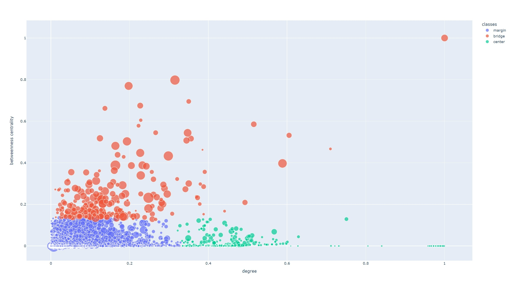
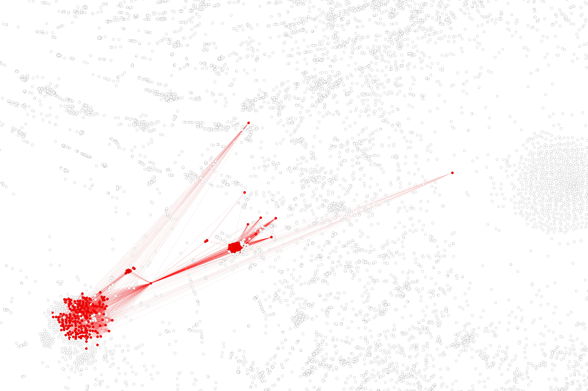
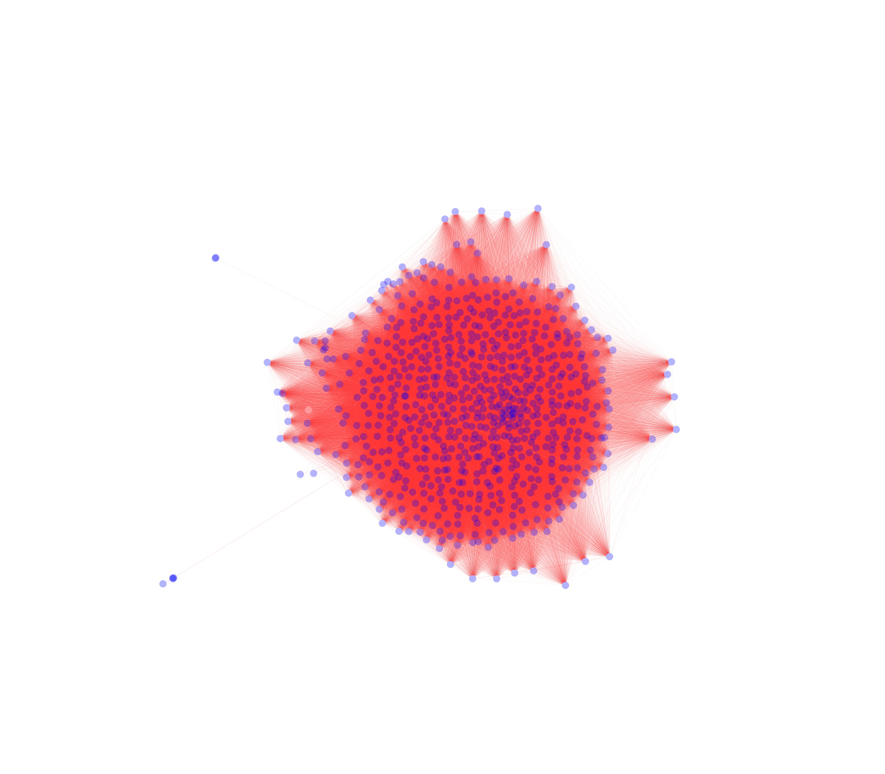
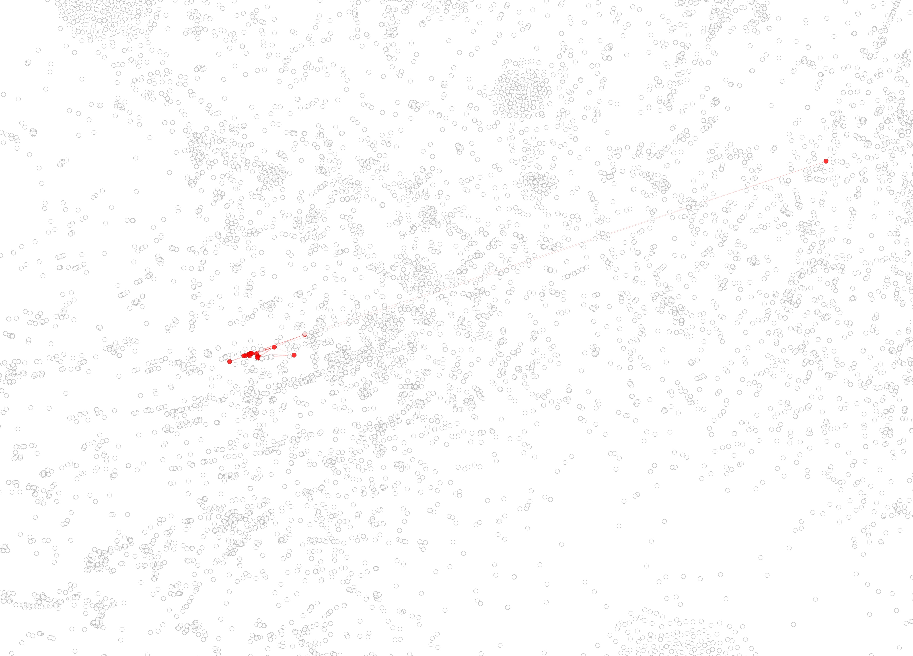

# CS3319
## 1. 可视化展示
### 1.1 网络数据可视化
节点的颜色表示该作者投稿最多的 field  
边的颜色表示权重大小

### 1.2 网络特征聚类结果

### 1.3 聚类得到的网络节点 Label

### 1.4 Explain 子图可视化
|原图|子图|
|-|-|
|||
|||
|||

## 2. 依赖项
- pytorch
- dgl
- networkx
- sklearn
- tqdm
- pandas
- plotly

## 3. 快速开始
1. 运行 `./gephi_input.py`，生成 `./node.csv` 和 `./edge.csv` （作为 Gephi 的输入）
   ```
   python gephi_input.py
   ```
2. **(Optional)** 运行 `./get_features.py` 生成聚类结果图 `./cluster_result.html`
   ```
   python get_features.py
   ```
3. 运行 `./gnnexplainer.py`，生成 `./sg_node.csv` 和 `./sg_edge.csv` （作为 Gephi 的输入）
   ```
   python gnnexplainer.py
   ```

## 4. 流程图


## TODO
- [ ] 评价边
- [x] 划分训练集和测试集
- [x] 可视化子图
- [ ] 使用提供的可视化工具