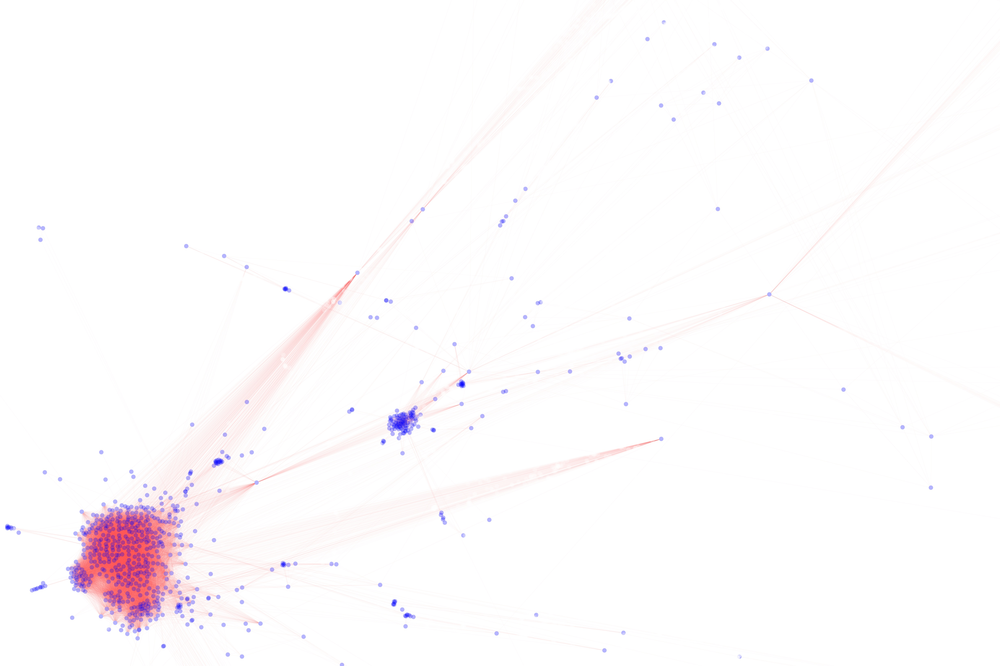

### CS3319
#### TODO
- [ ] 评价边
- [x] 划分训练集和测试集
- [x] 可视化子图
- [ ] 使用提供的可视化工具

#### 网络数据可视化
节点的颜色表示该作者投稿最多的 field 
边的颜色表示权重大小

#### 网络特征聚类结果

#### 聚类得到的网络节点 Label

#### Explain 子图可视化
|原图|子图|
|-|-|
|||
|||
|||